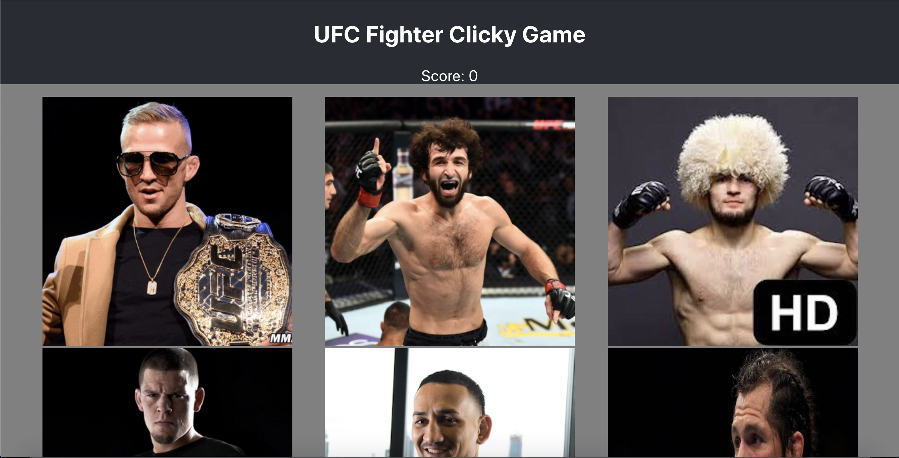

# clickygame
https://bbrier14.github.io/UFC-Memory-Game/
## Overview
The UFC Fighter Clicky Game is a simple React application. In it, the user will engage in a memory game. The goal is to click on photos of fighter that the user has not clicked on previously, aiming to get the highest score possible. 
## How It Works
The app will display 9 photos of various fighters and a score starting at 0. The user must click a different fighter every time the photos reshuffle to keep the score raising. If the user clicks a fighter that has previously been clicked, the score will reset to 0.
## Technologies Used
This application relies almost exclusively on React. Create-React-App was used to produce the initial application.
## Role
This is a solo project. As the only developer, I analyzed and interpreted the needs, wants, and requirements of the Product Owner (Trilogy) and created a functioning application from top to bottom that met those expectations.
## Screenshots

